<div align="center">


<p>
  
  
  
  
  
</p>

<h3><em>শূন্য থেকে confident TypeScript developer — basic type থেকে শুরু করে generics, utility types আর বড় project architecture পর্যন্ত</em></h3>


</div>

---

## 👤 এই হ্যান্ডবুক কাদের জন্য

| বিষয় | বিস্তারিত |
|---|---|
| 🎯 **Prerequisites** | JavaScript ES6+ (variable, function, array method, class, destructuring) ভালোভাবে জানা থাকা দরকার |
| 🧭 **Tooling** | `tsc` compiler, VS Code (built-in TS support) |
| 📦 **Version base** | TypeScript **5.x** (2026), Node.js **20+** |
| 🗣️ **ভাষা** | ব্যাখ্যা বাংলায় — code / API / term ইংরেজিতে |
| 🚫 **এই handbook-এ নেই** | React/Vue-এর মতো framework-specific TS (JSX typing আলাদা বিষয়) — এটা **pure TypeScript language**-এর উপর |

---

## 🧭 কীভাবে এই handbook পড়বে

এই guide **Phase** নয় — **Module** আকারে সাজানো, প্রতিটা একেকটা স্বতন্ত্র দক্ষতা। তিনটা **Track**-এ ভাগ করা আছে:

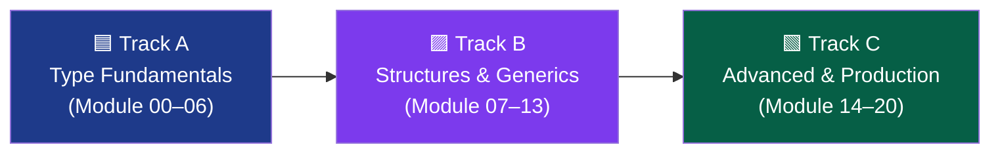

---

## 📑 Contents

<table>
<tr>
<td valign="top" width="33%">

**🟦 Track A — Type Fundamentals**
- [Module 00 — Setup & Mental Model](#module-00--setup--mental-model)
- [Module 01 — Basic Types](#module-01--basic-types)
- [Module 02 — Type Inference](#module-02--type-inference)
- [Module 03 — Arrays & Tuples](#module-03--arrays--tuples)
- [Module 04 — Functions](#module-04--functions)
- [Module 05 — Union & Intersection](#module-05--union--intersection-types)
- [Module 06 — Type Narrowing](#module-06--type-narrowing)

</td>
<td valign="top" width="33%">

**🟪 Track B — Structures & Generics**
- [Module 07 — Interfaces](#module-07--interfaces)
- [Module 08 — Type Aliases vs Interfaces](#module-08--type-aliases-vs-interfaces)
- [Module 09 — Generics](#module-09--generics)
- [Module 10 — Enums & Literal Types](#module-10--enums--literal-types)
- [Module 11 — Classes in TypeScript](#module-11--classes-in-typescript)
- [Module 12 — Utility Types](#module-12--utility-types)
- [Module 13 — Mapped & Conditional Types](#module-13--mapped--conditional-types)

</td>
<td valign="top" width="33%">

**🟩 Track C — Advanced & Production**
- [Module 14 — Type Guards & Assertions](#module-14--type-guards--assertions)
- [Module 15 — Modules & Declaration Files](#module-15--modules--declaration-files)
- [Module 16 — Async & Promises in TS](#module-16--async--promises-in-ts)
- [Module 17 — tsconfig Deep Dive](#module-17--tsconfig-deep-dive)
- [Module 18 — Working with Libraries](#module-18--working-with-libraries)
- [Module 19 — Best Practices & Pitfalls](#module-19--best-practices--pitfalls)
- [Module 20 — Build Track](#module-20--project-build-track)

</td>
</tr>
</table>

---

## ⚠️ আগে জেনে নাও — JavaScript vs TypeScript

| শুধু JavaScript | TypeScript যোগ করে |
|---|---|
| Runtime-এ type error ধরা পড়ে | **Compile-time**-এই type error ধরা যায় |
| `function add(a, b)` — a, b যেকোনো কিছু হতে পারে | `function add(a: number, b: number): number` — নির্দিষ্ট চুক্তি |
| IDE autocomplete সীমিত | সম্পূর্ণ type জানার কারণে **rich autocomplete** |
| Refactor করলে ভয় লাগে, কী ভাঙবে বোঝা যায় না | Refactor করলে **compiler নিজেই** ভাঙা অংশ দেখিয়ে দেয় |
| `undefined`/`null` bug runtime-এ ধরা পড়ে | `strictNullChecks` দিয়ে compile-time-এই ধরা যায় |
| কোনো official "contract" নেই | Interface/Type দিয়ে **self-documenting** কোড |

### 🏗️ Analogy
> **JavaScript** = নকশা ছাড়া বাড়ি বানানো — কাজ চলে, কিন্তু ভুল মাপ দিলে দেয়াল তুলে ফেলার পরই বোঝা যায়। **TypeScript** = আগে থেকে blueprint (নকশা) মেনে বাড়ি বানানো — ভুল মাপ blueprint স্টেজেই ধরা পড়ে, দেয়াল তোলার আগেই।

---

## Module 00 — Setup & Mental Model

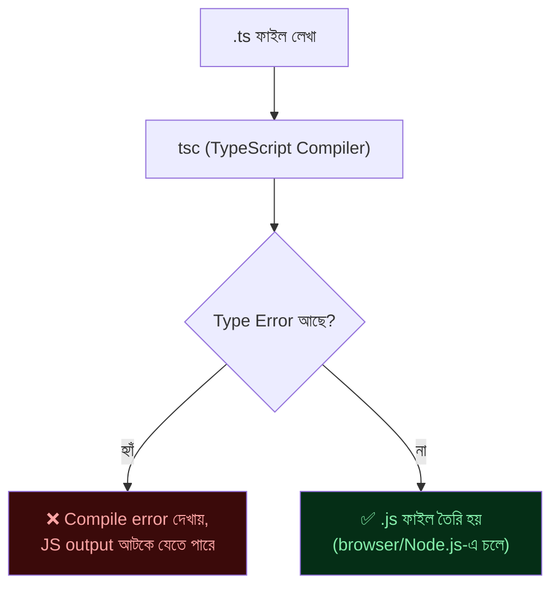

> 💡 **গুরুত্বপূর্ণ ধারণা:** TypeScript নিজে browser বা Node.js-এ **চলে না** — এটা শুধু compile-time-এ type check করে, তারপর সাধারণ JavaScript-এ **compile (transpile)** হয়ে যায়। মানে production-এ শেষ পর্যন্ত plain JS-ই চলে।

### Environment Setup

```bash
npm install -g typescript     # global install (ঐচ্ছিক)
npx tsc --version               # ভার্সন চেক

mkdir ts-playground && cd ts-playground
npm init -y
npm install typescript --save-dev
npx tsc --init                   # tsconfig.json তৈরি করে
```

```ts
// index.ts
function greet(name: string): string {
  return `হ্যালো, ${name}!`;
}
console.log(greet("Rahat"));
```

```bash
npx tsc index.ts     # index.js তৈরি হবে
node index.js          # চালানো
```

> ❌ **Common mistake:** `.ts` ফাইল সরাসরি `node index.ts` দিয়ে চালানোর চেষ্টা করা — Node.js নিজে থেকে TypeScript বোঝে না। হয় `tsc` দিয়ে compile করো, নয়তো `ts-node` বা `tsx` ব্যবহার করো।

---

## Module 01 — Basic Types

```ts
let age: number = 25;
let name: string = "Farhana";
let isActive: boolean = true;
let notDefined: undefined = undefined;
let empty: null = null;

// any — টাইপ চেকিং বন্ধ করে দেয় (এড়িয়ে চলা উচিত)
let anything: any = "কিছু একটা";
anything = 42;          // কোনো error দেবে না — এটাই সমস্যা

// unknown — নিরাপদ বিকল্প, ব্যবহারের আগে check বাধ্যতামূলক
let value: unknown = "হ্যালো";
if (typeof value === "string") {
  console.log(value.toUpperCase());   // এখানে safe, TS জানে এটা string
}

// void — function কিছু return করে না
function logMessage(msg: string): void {
  console.log(msg);
}

// never — function কখনোই স্বাভাবিকভাবে শেষ হয় না
function throwError(message: string): never {
  throw new Error(message);
}
```

### `any` vs `unknown`

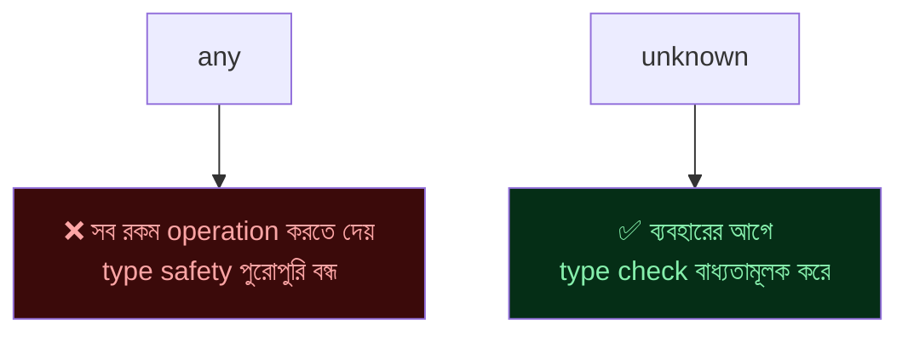

> ❌ **সবচেয়ে সাধারণ ভুল:** টাইপ বুঝতে সমস্যা হলেই `any` দিয়ে ঢেকে দেওয়া। এতে TypeScript ব্যবহারের পুরো সুবিধাই হারিয়ে যায়। বরং `unknown` ব্যবহার করো, বা সময় নিয়ে সঠিক type বের করো।

---

## Module 02 — Type Inference

### Definition
Type annotation না লিখলেও TypeScript context দেখে নিজে থেকেই type "অনুমান" করে নেয়।

```ts
let count = 10;          // TS নিজেই বুঝে নেয়: number
let city = "Dhaka";       // TS নিজেই বুঝে নেয়: string

// count = "text";        // ❌ Error — number-এ string assign করা যাবে না

// Function return type-ও infer হয়
function double(x: number) {
  return x * 2;            // TS জানে return type: number
}

// Array-ও infer হয়
const numbers = [1, 2, 3];   // number[]
```

> 💡 **নিয়ম:** যেখানে TypeScript নিজে থেকেই সঠিক type বুঝে নিতে পারে (variable-এর সাথেই assign করা হচ্ছে), সেখানে explicit annotation না লিখে **inference-এর উপর ভরসা করো** — কোড পরিষ্কার থাকে। শুধু function parameter, বা যেখানে ambiguity আছে সেখানে annotation দাও।

---

## Module 03 — Arrays & Tuples

```ts
// Array — একই type-এর একাধিক item
const scores: number[] = [90, 85, 78];
const names: Array<string> = ["Rakib", "Tania"];   // generic syntax, একই অর্থ

// Tuple — নির্দিষ্ট সংখ্যক item, প্রতিটার নির্দিষ্ট type ও ক্রম
let user: [string, number] = ["Rakib", 25];
// user = [25, "Rakib"];   // ❌ Error — ক্রম উল্টে গেলে type mismatch

// Named tuple (readability বাড়ানোর জন্য)
let point: [x: number, y: number] = [10, 20];

// Readonly array — বদলানো যাবে না
const fixedList: readonly number[] = [1, 2, 3];
// fixedList.push(4);   // ❌ Error — readonly array-তে push নিষিদ্ধ
```

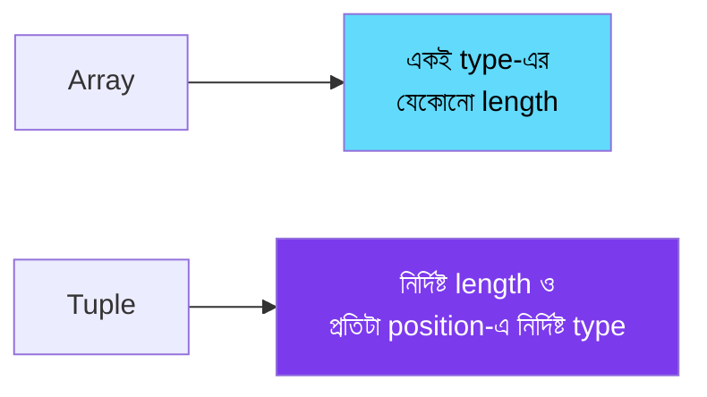

> ❌ Tuple-এ যত item দরকার তার বেশি/কম দেওয়া, বা ক্রম উল্টে দেওয়া — TypeScript এটা ধরবে, কিন্তু ভুলটা প্রায়ই আসে কারণ runtime-এ (plain array হিসেবে) এটা কাজ করেই ফেলবে যদি টাইপ চেক এড়িয়ে যাও।

---

## Module 04 — Functions

```ts
// Parameter ও return type annotation
function add(a: number, b: number): number {
  return a + b;
}

// Optional parameter — ? দিয়ে
function greet(name: string, title?: string): string {
  return title ? `${title} ${name}` : name;
}

// Default parameter
function createUser(name: string, role: string = "user") {
  return { name, role };
}

// Rest parameter
function sum(...numbers: number[]): number {
  return numbers.reduce((total, n) => total + n, 0);
}

// Function type হিসেবে variable-এ রাখা
let multiply: (a: number, b: number) => number;
multiply = (a, b) => a * b;   // parameter type আলাদা করে লিখতে হয় না — inferred

// Function overloading — একই নামে ভিন্ন signature
function format(value: string): string;
function format(value: number): string;
function format(value: string | number): string {
  return typeof value === "number" ? value.toFixed(2) : value.trim();
}
```

> ❌ **Common mistake:** optional parameter (`?`) required parameter-এর **আগে** রাখা — `function f(a?: string, b: number)` ❌ error দেবে। Optional parameter সবসময় শেষে থাকতে হয়।

---

## Module 05 — Union & Intersection Types

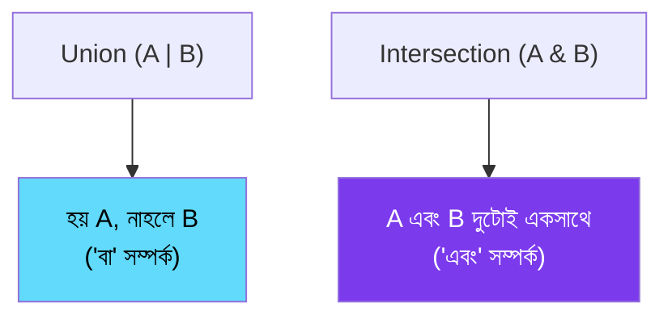

```ts
// Union — একাধিক সম্ভাব্য type-এর যেকোনো একটা
function printId(id: string | number) {
  console.log(`ID: ${id}`);
}
printId(101);
printId("A-101");

// Literal union — নির্দিষ্ট কিছু value-এর মধ্যেই সীমাবদ্ধ
type Status = "pending" | "approved" | "rejected";
let orderStatus: Status = "pending";
// orderStatus = "cancelled";   // ❌ Error — Status-এ এই value নেই

// Intersection — দুইটা type মিলিয়ে একটা নতুন type
type Timestamped = { createdAt: Date };
type Named = { name: string };
type Post = Timestamped & Named;   // দুটো property-ই থাকতে হবে

const post: Post = { name: "প্রথম পোস্ট", createdAt: new Date() };
```

> 💡 Union type ব্যবহার করলে সেটা নিয়ে কাজ করার আগে **narrowing** দরকার হয় (Module 06 দেখো) — কারণ কম্পাইলার নিশ্চিত না কোন type-টা আসলে runtime-এ আছে।

---

## Module 06 — Type Narrowing

### Definition
Union type-এর একটা variable-কে check করে (if/typeof/instanceof দিয়ে) TypeScript-কে বোঝানো যে এখন সেটা কোন নির্দিষ্ট type — একে "narrowing" বলে।

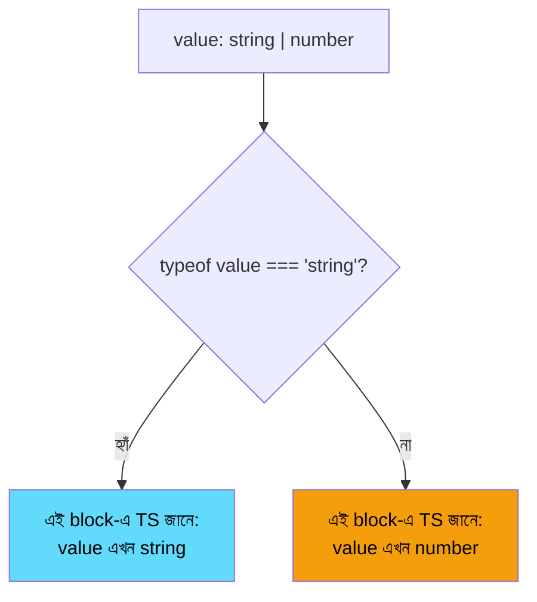

```ts
function formatValue(value: string | number) {
  if (typeof value === "string") {
    return value.toUpperCase();   // ✅ এখানে TS জানে এটা string
  }
  return value.toFixed(2);          // ✅ এখানে বাকি সম্ভাবনা number
}

// instanceof — class instance narrow করা
class Dog { bark() { return "ঘেউ"; } }
class Cat { meow() { return "মিয়াও"; } }

function makeSound(animal: Dog | Cat) {
  if (animal instanceof Dog) {
    return animal.bark();
  }
  return animal.meow();
}

// in operator — object-এ property আছে কিনা check
type Circle = { radius: number };
type Square = { side: number };

function area(shape: Circle | Square) {
  if ("radius" in shape) {
    return Math.PI * shape.radius ** 2;
  }
  return shape.side ** 2;
}

// Discriminated union — সবচেয়ে শক্তিশালী pattern
type Success = { status: "success"; data: string };
type Failure = { status: "error"; message: string };
type Result = Success | Failure;

function handle(result: Result) {
  if (result.status === "success") {
    console.log(result.data);       // TS জানে এটা Success
  } else {
    console.log(result.message);   // TS জানে এটা Failure
  }
}
```

> ❌ **Common mistake:** narrowing না করেই union type-এর member-specific property ব্যবহার করা — `Property 'bark' does not exist on type 'Dog | Cat'` error আসবে। সবসময় আগে check করো, তারপর access করো।

---

## Module 07 — Interfaces

### Definition
`interface` হলো একটা object-এর "shape" (কাঠামো) সংজ্ঞায়িত করার উপায় — কোন property থাকবে, কী type হবে।

```ts
interface User {
  readonly id: number;      // readonly — একবার সেট হলে বদলানো যাবে না
  name: string;
  email: string;
  age?: number;                // optional property
}

function displayUser(user: User) {
  console.log(`${user.name} (${user.email})`);
}

const user: User = { id: 1, name: "Bithi", email: "bithi@mail.com" };
// user.id = 2;   // ❌ Error — readonly property বদলানো যাবে না

// Interface extend করা — inheritance-এর মতো
interface Admin extends User {
  permissions: string[];
}

const admin: Admin = {
  id: 2,
  name: "Kamal",
  email: "kamal@mail.com",
  permissions: ["read", "write", "delete"],
};

// Function shape define করতে interface
interface AddFunction {
  (a: number, b: number): number;
}
const add: AddFunction = (a, b) => a + b;

// Class-এ interface implement করা — একটা "contract"
interface Shape {
  area(): number;
}
class Circle implements Shape {
  constructor(private radius: number) {}
  area() {
    return Math.PI * this.radius ** 2;
  }
}
```

> ❌ Optional property (`?`) ব্যবহার না করে সব field required রাখা, যদিও বাস্তবে কিছু field কখনো নাও থাকতে পারে — এতে object তৈরি করতেই বাধ্য হয়ে অপ্রয়োজনীয় dummy value বসাতে হয়।

---

## Module 08 — Type Aliases vs Interfaces

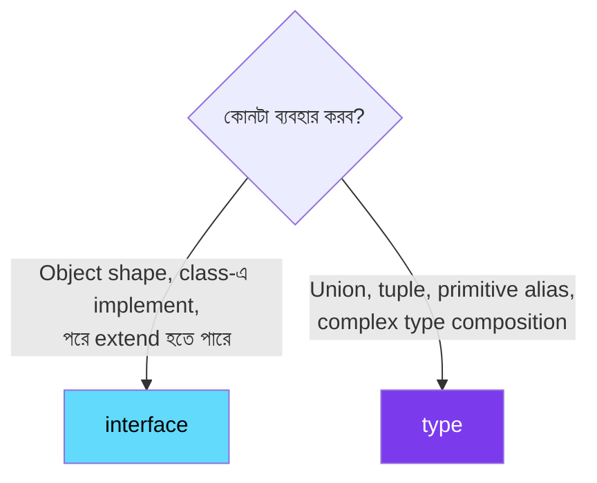

```ts
// type alias — যেকোনো type-কে নাম দেওয়া
type ID = string | number;               // union — interface দিয়ে এটা করা যায় না
type Point = { x: number; y: number };    // object shape-ও করা যায়
type Coordinates = [number, number];        // tuple

// interface — শুধু object shape, কিন্তু "declaration merging" সুবিধা পায়
interface Config {
  timeout: number;
}
interface Config {          // ✅ একই নামে আবার লিখলে merge হয়ে যায়
  retries: number;
}
const config: Config = { timeout: 5000, retries: 3 };
```

| বিষয় | `interface` | `type` |
|---|---|---|
| Object shape define | ✅ | ✅ |
| Union/Intersection | ❌ | ✅ |
| Declaration merging (একাধিকবার define করে merge) | ✅ | ❌ |
| Class-এ `implements` করা | ✅ | ✅ (তবে convention হলো interface) |
| সাধারণ পরামর্শ | Public API, object shape-এর জন্য | Union, utility composition-এর জন্য |

> 💡 দুটোই বেশিরভাগ ক্ষেত্রে বিনিময়যোগ্য — team/project-এর convention মেনে চলো, শুধু মনে রাখো union/tuple দরকার হলে `type` বাধ্যতামূলক।

---

## Module 09 — Generics

### Definition
Generics হলো এমন type যেটা **এখনই নির্দিষ্ট নয়**, বরং ব্যবহারের সময় নির্ধারিত হয় — একটা function/class/interface-কে বিভিন্ন type-এর সাথে reusable করে তোলে, type safety হারানো ছাড়াই।

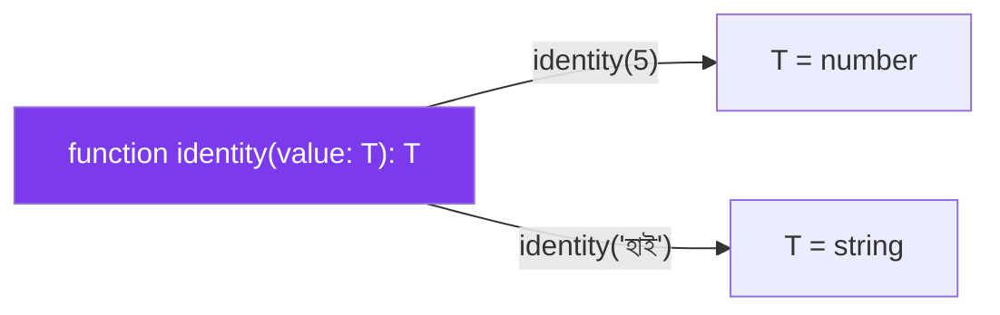

```ts
// Generic function — যেকোনো type-এর জন্য reusable, কিন্তু type safe
function identity<T>(value: T): T {
  return value;
}
identity<number>(42);         // T = number
identity("হ্যালো");             // T inferred = string (annotation না দিলেও চলে)

// ❌ any দিয়ে করলে type safety হারায়
function identityAny(value: any): any {
  return value;
}
const result = identityAny(5);
result.toUpperCase();   // কোনো error দেবে না, কিন্তু runtime-এ crash করবে!

// Generic দিয়ে একই ভুল আর সম্ভব না
const resultGeneric = identity(5);
// resultGeneric.toUpperCase();   // ✅ TS compile-time-এই error দেবে

// Generic interface
interface ApiResponse<T> {
  data: T;
  status: number;
}
const userResponse: ApiResponse<{ name: string }> = {
  data: { name: "Shanto" },
  status: 200,
};

// Generic class
class Box<T> {
  constructor(private content: T) {}
  getContent(): T {
    return this.content;
  }
}
const numberBox = new Box<number>(100);
const stringBox = new Box("টেক্সট");   // inferred: Box<string>

// Constraint — generic-এর উপর সীমা বসানো
function getLength<T extends { length: number }>(item: T): number {
  return item.length;
}
getLength("Hello");        // ✅ string-এর length আছে
getLength([1, 2, 3]);        // ✅ array-এর length আছে
// getLength(42);            // ❌ Error — number-এর length নেই
```

> 💡 **কখন generic দরকার:** যখন একটা function/class একাধিক ভিন্ন type-এর সাথে একইভাবে কাজ করবে, কিন্তু `any` ব্যবহার করলে type safety হারিয়ে ফেলবে। Generic `any`-এর নিরাপদ বিকল্প — "flexible কিন্তু type-checked"।

> ❌ প্রতিটা function-এ প্রয়োজন ছাড়াই generic ঢুকিয়ে দেওয়া — code জটিল করে তোলে। শুধু যখন সত্যিই একাধিক type-এর জন্য reusability দরকার তখনই ব্যবহার করো।

---

## Module 10 — Enums & Literal Types

```ts
// Numeric enum — ডিফল্টভাবে 0 থেকে শুরু
enum Direction {
  Up,       // 0
  Down,    // 1
  Left,     // 2
  Right,   // 3
}
let move: Direction = Direction.Up;

// String enum — বেশি readable, debug করা সহজ
enum Status {
  Pending = "PENDING",
  Approved = "APPROVED",
  Rejected = "REJECTED",
}
let orderStatus: Status = Status.Pending;

// ✅ আধুনিক বিকল্প — literal union (অনেক সময় enum-এর চেয়ে পছন্দনীয়)
type StatusLiteral = "PENDING" | "APPROVED" | "REJECTED";
let orderStatus2: StatusLiteral = "PENDING";

// const assertion দিয়ে object থেকে literal union বানানো
const ROLES = ["admin", "editor", "viewer"] as const;
type Role = typeof ROLES[number];   // "admin" | "editor" | "viewer"
```

> 💡 **আধুনিক পরামর্শ (TS community-তে বহুল প্রচলিত):** `enum`-এর বদলে literal union type ব্যবহার করা অনেক ক্ষেত্রে ভালো — কম্পাইল হওয়া output ছোট হয়, আচরণ predictable হয়, আর tree-shaking সহজ হয়। তবে `enum` এখনো valid ও কিছু ক্ষেত্রে (reverse mapping দরকার হলে) সুবিধাজনক।

---

## Module 11 — Classes in TypeScript

```ts
class BankAccount {
  // Access modifier — public (default), private, protected
  public accountHolder: string;
  private balance: number;
  protected accountType: string = "সাধারণ";

  constructor(accountHolder: string, initialBalance: number) {
    this.accountHolder = accountHolder;
    this.balance = initialBalance;
  }

  deposit(amount: number): void {
    this.balance += amount;
  }

  getBalance(): number {
    return this.balance;
  }
}

// Shorthand — constructor parameter-এই modifier দিলে property auto তৈরি হয়
class Product {
  constructor(
    public name: string,
    private price: number,
    readonly sku: string
  ) {}

  getPrice(): number {
    return this.price;
  }
}

// Abstract class — নিজে instantiate করা যায় না, শুধু extend করার জন্য
abstract class Shape {
  abstract area(): number;   // subclass-কে implement করতে হবে

  describe(): string {
    return `এই আকৃতির ক্ষেত্রফল: ${this.area()}`;
  }
}
class Square extends Shape {
  constructor(private side: number) {
    super();
  }
  area(): number {
    return this.side ** 2;
  }
}
```

| Modifier | কোথা থেকে access করা যায় |
|---|---|
| `public` (default) | সবজায়গা থেকে |
| `private` | শুধু নিজের class-এর ভেতর থেকে |
| `protected` | নিজের class ও subclass থেকে |
| `readonly` | সেট করা যায় শুধু constructor-এ, পরে পড়া যায় (বদলানো যায় না) |

> ❌ `abstract class` সরাসরি `new Shape()` দিয়ে instantiate করার চেষ্টা করা — কম্পাইলার error দেবে। Abstract class শুধু extend করার জন্য।

---

## Module 12 — Utility Types

### Definition
TypeScript built-in কিছু "helper type" দেয় যেগুলো দিয়ে existing type থেকে নতুন type সহজে তৈরি করা যায় — বারবার একই জিনিস হাতে না লিখে।

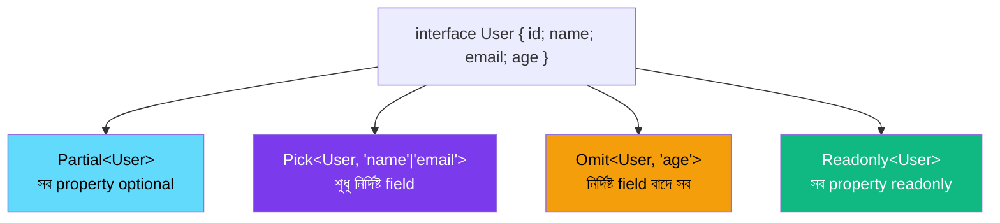

```ts
interface User {
  id: number;
  name: string;
  email: string;
  age: number;
}

// Partial — সব property optional করে দেয় (update function-এ দরকারি)
function updateUser(id: number, changes: Partial<User>) {
  // changes = { name: "নতুন নাম" } — শুধু যা বদলাবে তাই দিলেই চলবে
}

// Pick — শুধু নির্দিষ্ট কিছু property নিয়ে নতুন type
type UserPreview = Pick<User, "name" | "email">;

// Omit — নির্দিষ্ট property বাদ দিয়ে বাকি সব
type UserWithoutId = Omit<User, "id">;

// Readonly — সব property immutable করে দেয়
const frozenUser: Readonly<User> = { id: 1, name: "Rumi", email: "r@r.com", age: 30 };
// frozenUser.name = "X";   // ❌ Error

// Record — key-value shape দ্রুত তৈরি
type RolePermissions = Record<"admin" | "editor" | "viewer", string[]>;
const permissions: RolePermissions = {
  admin: ["read", "write", "delete"],
  editor: ["read", "write"],
  viewer: ["read"],
};

// Required — সব optional property-কে required করে দেয়
type CompleteUser = Required<Partial<User>>;   // Partial-এর উল্টো effect

// ReturnType — কোনো function-এর return type বের করা
function createUser() {
  return { id: 1, name: "X" };
}
type NewUser = ReturnType<typeof createUser>;   // { id: number; name: string }
```

| Utility Type | কাজ |
|---|---|
| `Partial<T>` | সব property optional |
| `Required<T>` | সব property required |
| `Pick<T, Keys>` | নির্দিষ্ট কিছু property বাছাই |
| `Omit<T, Keys>` | নির্দিষ্ট property বাদ |
| `Readonly<T>` | সব property immutable |
| `Record<Keys, Value>` | key-value shape তৈরি |
| `ReturnType<T>` | function-এর return type বের করা |

> 💡 এগুলো হাতে লেখা এড়িয়ে **DRY (Don't Repeat Yourself)** নীতি মেনে চলার সবচেয়ে শক্তিশালী হাতিয়ার — একটা মূল `interface` থেকেই যাবতীয় ভিন্নতা তৈরি করা যায়।

---

## Module 13 — Mapped & Conditional Types

```ts
// Mapped type — একটা type-এর সব key নিয়ে নতুন type তৈরি
type Optional<T> = {
  [K in keyof T]?: T[K];      // এটাই আসলে Partial<T>-এর ভেতরের implementation
};

type Flags<T> = {
  [K in keyof T]: boolean;    // প্রতিটা key-কে boolean বানিয়ে দেয়
};
interface Settings { darkMode: boolean; notifications: boolean; }
type SettingsFlags = Flags<Settings>;   // { darkMode: boolean; notifications: boolean }

// Conditional type — TS-এর মধ্যে "if-else" এর মতো type-level logic
type IsString<T> = T extends string ? "হ্যাঁ" : "না";
type A = IsString<string>;   // "হ্যাঁ"
type B = IsString<number>;   // "না"

// বাস্তব ব্যবহার — nullable বাদ দেওয়া
type NonNullable<T> = T extends null | undefined ? never : T;
type CleanType = NonNullable<string | null>;   // string
```

> 💡 এগুলো advanced feature — লাইব্রেরি লেখার সময় বা খুব জটিল type-level logic দরকার হলে কাজে লাগে। রোজকার application code-এ কম লাগলেও, TypeScript-এর built-in utility type কীভাবে কাজ করে তা বুঝতে সাহায্য করে।

---

## Module 14 — Type Guards & Assertions

```ts
// Custom type guard — নিজের function দিয়ে narrowing শেখানো
interface Cat { meow(): void; }
interface Dog { bark(): void; }

function isCat(animal: Cat | Dog): animal is Cat {
  return (animal as Cat).meow !== undefined;
}

function makeSound(animal: Cat | Dog) {
  if (isCat(animal)) {
    animal.meow();   // ✅ TS জানে এটা Cat
  } else {
    animal.bark();     // ✅ TS জানে এটা Dog
  }
}

// Type assertion — কম্পাইলারকে বলা "আমি জানি এটার type কী"
const input = document.getElementById("email") as HTMLInputElement;
console.log(input.value);   // as ছাড়া HTMLElement-এ .value থাকে না বলে error দিত

// Non-null assertion (!) — বলা "এটা null/undefined না, guaranteed"
function getUser(id: number): User | undefined {
  return users.find((u) => u.id === id);
}
const user = getUser(1)!;   // "আমি নিশ্চিত এটা undefined হবে না"
```

> ❌ **সবচেয়ে বিপজ্জনক ভুল:** type assertion (`as`) বা non-null assertion (`!`) দিয়ে ভুল guarantee দেওয়া। এগুলো compiler-কে চুপ করিয়ে দেয়, কিন্তু runtime-এ যদি ধারণা ভুল হয়, তাহলে **crash** হবে। শুধু তখনই ব্যবহার করো যখন সত্যিই ১০০% নিশ্চিত, নাহলে proper runtime check করো।

---

## Module 15 — Modules & Declaration Files

```ts
// math.ts
export function add(a: number, b: number): number {
  return a + b;
}
export interface Point {
  x: number;
  y: number;
}
export default class Calculator {
  add(a: number, b: number) { return a + b; }
}
```

```ts
// app.ts
import Calculator, { add, Point } from "./math";

const calc = new Calculator();
const point: Point = { x: 1, y: 2 };
```

### Declaration files (`.d.ts`)

```ts
// types.d.ts — শুধু type information, কোনো actual code না
declare module "some-untyped-library" {
  export function doSomething(value: string): number;
}
```

> 💡 যখন কোনো plain JavaScript library-তে official TypeScript support নেই, তখন `npm install --save-dev @types/library-name` (DefinitelyTyped প্রজেক্ট থেকে community-maintained type) দিয়ে অথবা নিজের `.d.ts` লিখে type পাওয়া যায়।

> ❌ প্রতিটা import-এর সামনে file extension (`.ts`) লেখা — TypeScript module resolution-এ এটা লাগে না, বরং `tsconfig`-এর মডিউল সেটিং অনুযায়ী handle হয়।

---

## Module 16 — Async & Promises in TS

```ts
// Promise-এর generic type — কী resolve হবে তা বলা
function fetchUser(id: number): Promise<User> {
  return fetch(`/api/users/${id}`).then((res) => res.json());
}

// async/await — TS স্বয়ংক্রিয়ভাবে return type infer করে Promise<T> হিসেবে
async function loadUser(id: number): Promise<User> {
  const response = await fetch(`/api/users/${id}`);
  const data: User = await response.json();
  return data;
}

// Error handling সহ, typed catch (unknown হিসেবে আসে TS 4.4+)
async function safeLoad(id: number) {
  try {
    return await loadUser(id);
  } catch (error) {
    if (error instanceof Error) {
      console.error(error.message);
    }
    return null;
  }
}

// Generic API wrapper — বাস্তব প্রজেক্টে খুবই common pattern
async function apiGet<T>(url: string): Promise<T> {
  const res = await fetch(url);
  if (!res.ok) throw new Error(`Request failed: ${res.status}`);
  return res.json() as Promise<T>;
}

const user = await apiGet<User>("/api/users/1");   // T = User, fully typed
```

> ❌ `catch` block-এ error-কে সরাসরি `error.message` করে ফেলা টাইপ চেক ছাড়াই — TypeScript-এ `catch` clause default-ভাবে `unknown` type ধরে, তাই আগে `instanceof Error` check করতে হয়।

---

## Module 17 — tsconfig Deep Dive

```json
{
  "compilerOptions": {
    "target": "ES2022",          // কোন JS ভার্সনে compile হবে
    "module": "ESNext",           // module system
    "strict": true,                 // সব strict check চালু (সবচেয়ে গুরুত্বপূর্ণ flag)
    "strictNullChecks": true,      // null/undefined আলাদাভাবে ধরা পড়বে
    "noImplicitAny": true,          // any implicitly হলে error দেবে
    "esModuleInterop": true,        // CommonJS/ES module মিশ্রণ সহজ করে
    "outDir": "./dist",              // compiled JS কোথায় যাবে
    "rootDir": "./src",               // source ফাইল কোথায়
    "skipLibCheck": true               // node_modules-এর .d.ts check স্কিপ (দ্রুত build)
  },
  "include": ["src/**/*"]
}
```

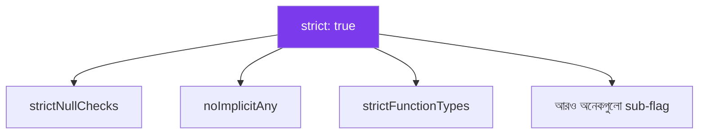

> 💡 **সবচেয়ে গুরুত্বপূর্ণ পরামর্শ:** নতুন project শুরু করলে সবসময় `"strict": true` দিয়ে শুরু করো। এতে শুরুতে একটু বেশি error দেখতে হবে ঠিকই, কিন্তু TypeScript-এর আসল সুরক্ষা তখনই পাওয়া যায়। পরে strict mode চালু করা একটা বড় legacy codebase-এ অনেক কঠিন কাজ।

> ❌ `strict: false` রেখে বছরের পর বছর কোড লেখা — ধীরে ধীরে `any`-এ ভরে যায়, TypeScript ব্যবহারের সুবিধা প্রায় শূন্যে নেমে আসে।

---

## Module 18 — Working with Libraries

```bash
# কোনো library-তে built-in TS type থাকলে — কিছু করতে হয় না
npm install axios

# built-in type না থাকলে — community type খোঁজা
npm install lodash
npm install --save-dev @types/lodash
```

```ts
import axios from "axios";           // axios নিজেই TS-এ লেখা, type built-in
import _ from "lodash";                // @types/lodash থেকে type আসে

interface ApiUser {
  id: number;
  name: string;
}

async function getUsers(): Promise<ApiUser[]> {
  const response = await axios.get<ApiUser[]>("/api/users");
  return response.data;   // ইতিমধ্যে typed: ApiUser[]
}
```

> 💡 `@types/*` প্যাকেজ (DefinitelyTyped প্রজেক্ট) হলো কমিউনিটি-maintained type definition — যদি কোনো library-তে built-in `.d.ts` না থাকে, প্রথমে `@types/package-name` চেক করো npm-এ।

---

## Module 19 — Best Practices & Pitfalls

| নিয়ম | কারণ |
|---|---|
| `strict: true` দিয়ে শুরু করো | Full type safety নিশ্চিত করে |
| `any` এড়িয়ে চলো, `unknown` পছন্দ করো | Type safety বজায় থাকে |
| Function-এর return type explicit লেখো (public API-তে) | Documentation + দুর্ঘটনাক্রমে বদলানো রোধ |
| Interface/Type দিয়ে data shape প্রথমে ভাবো | Design স্পষ্ট হয়, code পরে সহজে লেখা যায় |
| Type assertion (`as`) কম ব্যবহার করো | ভুল assertion runtime bug তৈরি করে |
| Utility type ব্যবহার করে repetition কমাও | DRY code, একটামাত্র "source of truth" |

```ts
// ❌ খারাপ — কোনো type নেই, কার্যত plain JS
function processOrder(order) {
  return order.items.map((i) => i.price * i.qty);
}

// ✅ ভালো — clear contract, autocomplete, compile-time safety
interface OrderItem {
  price: number;
  qty: number;
}
interface Order {
  items: OrderItem[];
}
function processOrderTyped(order: Order): number[] {
  return order.items.map((item) => item.price * item.qty);
}
```

> ❌ **সবচেয়ে ব্যাপক ভুল:** "TypeScript শেখা মানে জাভাস্ক্রিপ্ট + কিছু `: type` লিখে দেওয়া" — ভাবা। আসল দক্ষতা হলো **টাইপ দিয়ে ডিজাইন করা**: কোড লেখার আগেই ভাবো ডেটার shape কী হবে, কোন state সম্ভব, কোনটা অসম্ভব — এটাই TypeScript-এর আসল শক্তি।

---

## Module 20 — Project Build Track

### 🚀 ক্রম মেনে এগোও

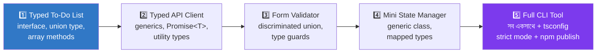

| Project | মূল দক্ষতা |
|---|---|
| **Typed To-Do List** | Interface, union literal type, array method typing |
| **Typed API Client** | Generic function, `Promise<T>`, utility types (`Partial`, `Pick`) |
| **Form Validator** | Discriminated union, custom type guard, error handling |
| **Mini State Manager** | Generic class, mapped/conditional type, readonly |
| **Full CLI Tool** | সব concept একসাথে + strict tsconfig + npm package হিসেবে publish |

### 🔄 একটা সাধারণ প্রবাহ (Typed API Client উদাহরণ)

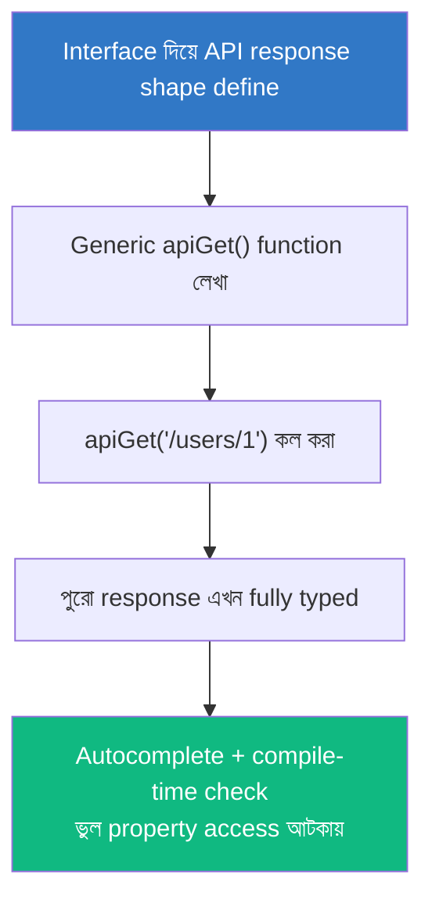

---

## ✅ TypeScript-Ready Checklist

- [ ] Basic type (`string`, `number`, `boolean`, `unknown`) ও কখন কী ব্যবহার করব জানি
- [ ] Union ও intersection type-এর পার্থক্য বুঝি
- [ ] Type narrowing (`typeof`, `instanceof`, discriminated union) করতে পারি
- [ ] Interface ও type alias-এর পার্থক্য এবং কখন কোনটা জানি
- [ ] Generic function/class লিখতে পারি
- [ ] গুরুত্বপূর্ণ utility type (`Partial`, `Pick`, `Omit`, `Record`) ব্যবহার করতে পারি
- [ ] Custom type guard লিখতে পারি
- [ ] Async function-এ সঠিকভাবে `Promise<T>` টাইপ করতে পারি
- [ ] `tsconfig.json`-এর `strict` mode-এর গুরুত্ব বুঝি
- [ ] নিজের একটা fully-typed multi-file project বানিয়েছি

> দশটার মধ্যে ৮টা ✅ হলে তুমি TypeScript-ready!

---

## 📚 Reference Links

<div align="center">

[](https://www.typescriptlang.org/docs/)
[](https://www.typescriptlang.org/play)
[](https://github.com/DefinitelyTyped/DefinitelyTyped)
[](https://www.totaltypescript.com)
[](https://typescript-eslint.io)

</div>

| বিষয় | লিংক |
|---|---|
| Official TypeScript Handbook | https://www.typescriptlang.org/docs/handbook/intro.html |
| TypeScript Playground (browser-এ লিখে দেখা) | https://www.typescriptlang.org/play |
| Utility Types সম্পূর্ণ লিস্ট | https://www.typescriptlang.org/docs/handbook/utility-types.html |
| DefinitelyTyped (@types প্যাকেজ) | https://github.com/DefinitelyTyped/DefinitelyTyped |
| typescript-eslint | https://typescript-eslint.io |

---

<div align="center">

### 💡 *"TypeScript মানে বেশি টাইপ করা না — বরং টাইপ দিয়ে চিন্তা করা।"*

⭐ কাজে লাগলে repo-টা star দাও!

<sub>Version note: TypeScript 5.x (2026) অনুযায়ী লেখা। Language দ্রুত develop হয় — সর্বশেষ feature-এর জন্য official docs-এ মিলিয়ে নিয়ো।</sub>


</div>
